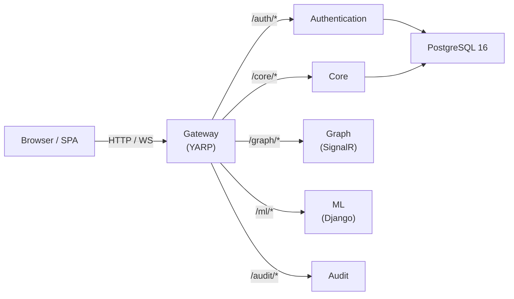
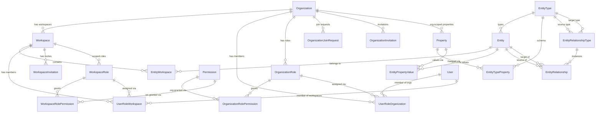
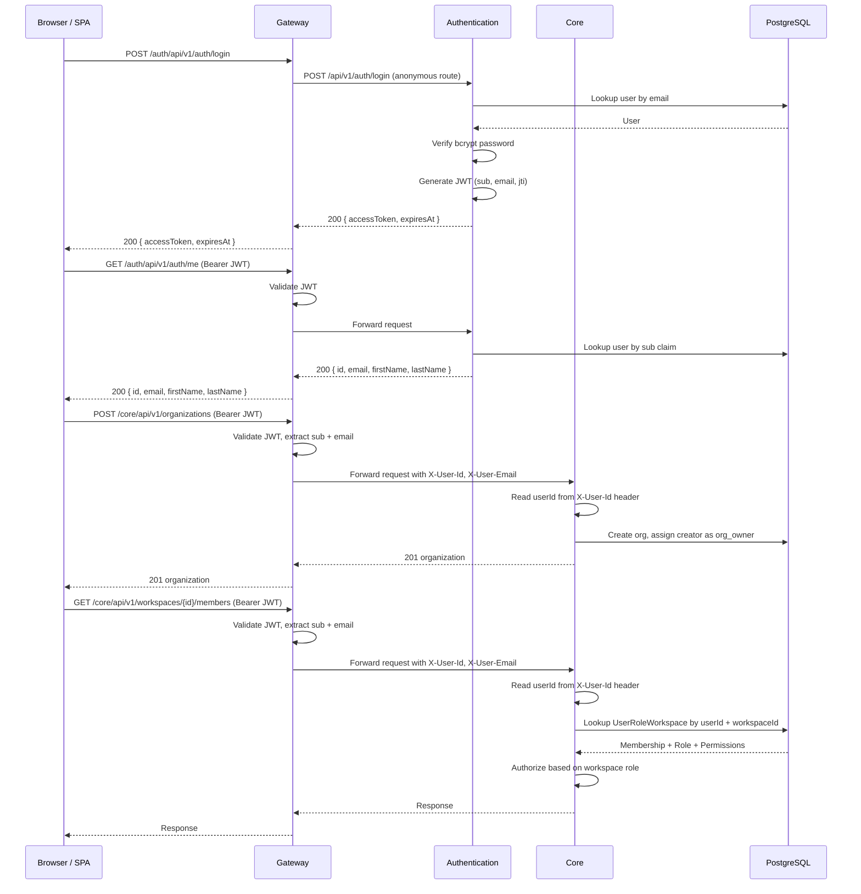

# Architecture -- Patterns, Layers, and Conventions

> **Last verified:** 2026-04-23 (EAV schema migration — entity model restructured to Entity-Attribute-Value pattern)

> **Maintenance obligation:** If you change architecture patterns, add or modify a layer, alter the persistence model, change validation or auth flows, or introduce new cross-cutting concerns, update this file and its "Last verified" date before finishing your task. See [AI-GUIDES-INDEX.md](../../AI-GUIDES-INDEX.md) for the full update matrix.

---

## High-Level Architecture



All client traffic flows through the **Gateway**. Backend services do not call each other directly -- there is no message bus, no gRPC, no service-to-service HTTP. The Gateway strips path prefixes and forwards requests to upstream services by internal Docker DNS.

---

## Layered / Clean Architecture

The project uses a **ports-and-adapters (Clean Architecture)** pattern. Each service that follows this pattern is split into four projects:

| Layer | Responsibility | Naming convention |
|---|---|---|
| **Host** | `Program.cs`, endpoint mapping, middleware | `Relativa.<Service>` |
| **Application** | Use cases, DTOs, validators, service interfaces/implementations | `Relativa.<Service>.Application` |
| **Domain** | Repository interfaces, service contracts, domain logic | `Relativa.<Service>.Domain` |
| **Infrastructure** | DbContext, EF repositories, external service implementations (JWT, bcrypt) | `Relativa.<Service>.Infrastructure` |

### Current state per service

| Service | Host | Application | Domain | Infrastructure |
|---|---|---|---|---|
| **Authentication** | Implemented | Implemented (AuthService, DTOs, validators) | Implemented (interfaces only) | Implemented (AuthDbContext, repos, JWT, bcrypt) |
| **Core** | Implemented (org, workspace, member, invitation, role, join-request, permission endpoints) | Implemented (OrganizationService, OrgMemberService, OrgInvitationService, OrgRoleService, JoinRequestService, WorkspaceService, WorkspaceMemberService, InvitationService, RoleService, DTOs, validators) | Implemented (repository interfaces, IWorkspaceContext) | Implemented (RelativaDbContext, repos, WorkspaceContext) |
| **Gateway** | Implemented | N/A (single project) | N/A | N/A |
| **Graph** | Implemented (stub hub) | N/A (single project) | N/A | N/A |
| **Audit** | Implemented (stub) | N/A (single project) | N/A | N/A |

Gateway, Graph, and Audit are single-project services with no layered split. When they grow, they should follow the same four-layer convention as Authentication.

### Dependency direction

```
Host → Application → Domain ← Infrastructure
                                    ↓
                              Persistence (shared)
```

- **Domain** defines interfaces; **Infrastructure** implements them.
- **Application** depends on Domain interfaces, never on Infrastructure directly.
- **Host** wires everything via DI and maps endpoints.
- All layers that need entities reference the shared **Persistence** library.

**Important caveat:** Domain interfaces return `Relativa.Persistence.Entities.*` types directly (e.g. `IUserRepository` returns `User`). This is a pragmatic coupling -- the domain layer is not isolated from the shared entity assembly.

---

## Data Modeling Conventions

### Third Normal Form (3NF)

All tables must satisfy **Third Normal Form**:

- **1NF**: no repeating groups, every column is atomic.
- **2NF**: all non-key attributes fully depend on the entire primary key.
- **3NF**: no transitive dependencies -- every non-key attribute depends on the key, the whole key, and nothing but the key.

**No denormalized columns.** Names, labels, and derived data are always resolved via JOINs, never duplicated across tables. This convention applies to all future schema changes.

---

## Shared Persistence Library

**Path:** `Persistence/src/Relativa.Persistence/`

This is a **.NET class library** (no solution, no runnable host) that holds the EF Core entity model shared across services. It is referenced via `ProjectReference` by Core, Authentication, and Migration.

### Contents

| Directory / File | What it contains |
|---|---|
| `Entities/` | 21 entity classes (see list below) |
| `Configurations/` | EF Fluent API `IEntityTypeConfiguration<T>` classes for each entity |
| `ModelBuilderExtensions.cs` | Extension methods: `ApplyAuthEntityConfigurations` (applies `UserConfiguration` and ignores the two direct navigation targets `UserRoleWorkspace` + `UserRoleOrganization` to prevent EF Core convention from discovering the full RBAC graph) and `ApplyAllEntityConfigurations` (full 21-entity model) |

### Entity list (21 entities)

| Entity | Table name | Notes |
|---|---|---|
| `User` | `users` | Credentials and profile. No `role_id` column (dropped). |
| `Organization` | `organizations` | Top-level tenant boundary. |
| `Workspace` | `workspaces` | Has `organization_id` FK (direct, no join table). |
| `OrganizationRole` | `organization_roles` | Org-scoped roles (system + custom). |
| `OrganizationRolePermission` | `organization_role_permissions` | Join between org roles and permissions. |
| `UserRoleOrganization` | `user_role_organization` | Org membership: user + org + org role. |
| `OrganizationJoinRequest` | `organization_join_requests` | Pending/approved/rejected requests to join an org. |
| `OrganizationInvitation` | `organization_invitations` | Email-based invitations to join an org. |
| `WorkspaceRole` | `workspace_roles` | Ws-scoped roles (system + custom). |
| `WorkspaceRolePermission` | `workspace_role_permissions` | Join between ws roles and permissions. |
| `UserRoleWorkspace` | `user_role_workspace` | Ws membership: user + workspace + ws role. |
| `Permission` | `permissions` | Shared by both org and ws role-permission joins. 16 granular permissions. |
| `WorkspaceInvitation` | `workspace_invitations` | Email-based invitations to join a workspace. |
| `EntityType` | `entity_type` | Named type discriminator (`client`, `deal`). Singular table name. |
| `Entity` | `entity` | Business record typed by EntityType. Singular table name. |
| `EntityWorkspace` | `entity_workspace` | Join between Entity and Workspace. Singular table name. |
| `Property` | `property` | **EAV.** Named attribute definition with data type (`String/Int/Decimal/Bool/Date`). `organization_id` nullable: `null` = global, set = org-specific custom property. |
| `EntityTypeProperty` | `entity_type_property` | **EAV schema layer.** Maps which properties belong to which entity type, with `is_required` flag. Composite PK `(entity_type_id, property_id)`. |
| `EntityPropertyValue` | `entity_property_value` | **EAV data layer.** Stores a concrete attribute value for an entity. Composite PK `(entity_id, property_id)`. Five typed value columns: `value_string`, `value_int`, `value_decimal`, `value_bool`, `value_date`. Only one is populated per row. |
| `EntityRelationshipType` | `entity_relationship_type` | **EAV schema layer.** Defines valid entity-type-to-entity-type link schemas (e.g. `deal_client`: deal → client). |
| `EntityRelationship` | `entity_relationship` | **EAV data layer.** A concrete directed link between two entity instances, typed by `EntityRelationshipType`. |

**Dropped in EAV migration:** `EntityProperty` (polymorphic hub), `PersonalDataPropertyValue`, `LocationPropertyValue`, `DealPropertyValue`. Their data is now stored as `EntityPropertyValue` rows. The deal→client association previously held as a FK in `DealPropertyValue.client_id` is now an `EntityRelationship` row of type `deal_client`.

**Table naming convention:** All entity-related tables use singular names (`entity_type`, `entity`, `entity_workspace`, `property`, etc.). Non-entity tables retain their original plural names (`users`, `organizations`, `workspaces`, etc.) and will be renamed in a future migration.

### Multiple DbContexts over one model

Different services compose **different slices** of the entity model:

| DbContext | Location | What it maps | Extension used |
|---|---|---|---|
| `AuthDbContext` | `Authentication/.../Infrastructure/Data/AuthDbContext.cs` | User only (other entities reachable via `User` navigation properties are cut with `Ignore<UserRoleWorkspace>()` + `Ignore<UserRoleOrganization>()`) | `ApplyAuthEntityConfigurations` |
| `RelativaDbContext` | `Core/.../Infrastructure/Data/RelativaDbContext.cs` | All 21 entities | `ApplyAllEntityConfigurations` |
| `MigrationDbContext` | `Migration/.../Data/MigrationDbContext.cs` | All 21 entities | `ApplyAllEntityConfigurations` |

Migrations are owned by the **Migration** service. The migration assembly name is `Relativa.Migration`. Schema changes always go through `Migration/src/Relativa.Migration/Migrations/`.

### DbContext Ownership Matrix

This matrix defines which service is the **authoritative writer** for each table, to support future schema splitting:

| Table | Auth (read/write) | Core (read/write) |
|---|---|---|
| `users` | **Read/Write** (credentials) | Read-only (identity resolution) |
| `organizations` | -- | **Read/Write** |
| `organization_roles` | -- | **Read/Write** |
| `organization_role_permissions` | -- | **Read/Write** |
| `user_role_organization` | -- | **Read/Write** |
| `organization_join_requests` | -- | **Read/Write** |
| `organization_invitations` | -- | **Read/Write** |
| `workspaces` | -- | **Read/Write** |
| `workspace_roles` | -- | **Read/Write** |
| `workspace_role_permissions` | -- | **Read/Write** |
| `user_role_workspace` | -- | **Read/Write** |
| `workspace_invitations` | -- | **Read/Write** |
| `permissions` | -- | **Read/Write** |
| `entity_type` | -- | **Read/Write** |
| `entity` | -- | **Read/Write** |
| `entity_workspace` | -- | **Read/Write** |
| `property` | -- | **Read/Write** |
| `entity_type_property` | -- | **Read/Write** |
| `entity_property_value` | -- | **Read/Write** |
| `entity_relationship_type` | -- | **Read/Write** |
| `entity_relationship` | -- | **Read/Write** |

**Rules:**
1. Auth service must **never write** to any table other than `users`.
2. Core service must **never write** to password hashes or JWT-related User fields.
3. New workspace/org-related configurations go into `ApplyAllEntityConfigurations()` only -- they are **not** added to `ApplyAuthEntityConfigurations()`.

---

## Domain Model



**Key relationships:**

- **Organization is the primary multi-tenant boundary.** Users must join an organization before they can access workspaces within it.
- `Organization` → `Workspace` is a direct FK (`workspaces.organization_id`), not a join table.
- **Split RBAC schema:** Organization roles and workspace roles are separate table hierarchies that share a common `permissions` table.
  - **Org path:** `User` → `UserRoleOrganization` → `OrganizationRole` → `OrganizationRolePermission` → `Permission`
  - **Ws path:** `User` → `UserRoleWorkspace` → `WorkspaceRole` → `WorkspaceRolePermission` → `Permission`
- **16 granular permissions** in the shared `permissions` table:
  - **7 org-scoped:** `manage_org_settings`, `invite_to_org`, `manage_join_requests`, `remove_org_members`, `assign_org_roles`, `manage_org_roles`, `create_workspaces`
  - **9 ws-scoped:** `manage_ws_settings`, `invite_to_workspace`, `add_ws_members`, `remove_ws_members`, `assign_ws_roles`, `manage_ws_roles`, `edit_deals`, `view_deals`, `view_analytics`
- **7 default system roles:**
  - **3 org roles:** `org_owner` (all 7 org perms), `org_admin` (subset), `org_member` (minimal)
  - **4 ws roles:** `ws_admin` (all 9 ws perms), `ws_manager` (subset), `ws_analyst` (view-only), `ws_member` (minimal)
- `OrganizationJoinRequest` tracks pending/approved/rejected requests from users wanting to join an org.
- `OrganizationInvitation` tracks email-based invitations to join an org (parallel to `WorkspaceInvitation` for workspaces).
- `Entity` belongs to workspaces via `EntityWorkspace` and is typed by `EntityType` (`client` or `deal`). All entity types use the same EAV storage — there are no separate per-type tables.
- **EAV two-level pattern:**
  - **Schema layer:** `EntityTypeProperty` defines which `Property` definitions belong to each `EntityType` (with `is_required`). `EntityRelationshipType` defines which entity type pairs can be linked (e.g. `deal_client`: deal → client).
  - **Data layer:** `EntityPropertyValue` holds a concrete typed value for one entity+property pair (composite PK). `EntityRelationship` holds a directed link between two entity instances, typed by `EntityRelationshipType`.
- **`Property` scoping:** `property.organization_id = NULL` means the property is global (system-wide); non-null means it is an org-defined custom property visible only to that organization.
- `OrganizationRole.OrganizationId` is **nullable** -- `null` for system roles, set for custom org-specific roles.
- `WorkspaceRole.WorkspaceId` is **nullable** -- `null` for system roles, set for custom workspace-specific roles.

---

## Validation Approach

Validation uses **FluentValidation** in the Application layer with explicit invocation in service methods.

### Flow

1. **Validator discovery:** `AddValidatorsFromAssemblyContaining<>()` in `Program.cs` registers all validators from the Application assembly via DI.
2. **Explicit validation:** Service methods call `validator.ValidateAndThrowAsync(request)` before any business logic.
3. **Exception mapping:** `GlobalExceptionHandler` middleware catches `ValidationException` and returns HTTP 400 with structured error details.

There is **no** global automatic validation filter or minimal-API endpoint filter. Validation is always explicitly called inside the application service.

### Validators implemented

**Authentication:**
- `LoginRequestValidator` -- in `Authentication/src/Relativa.Authentication.Application/Validators/`
- `RegisterRequestValidator` -- in `Authentication/src/Relativa.Authentication.Application/Validators/`

**Core:**
- `CreateWorkspaceRequestValidator`, `UpdateWorkspaceRequestValidator` -- workspace operations
- `InviteMemberRequestValidator`, `AcceptInvitationRequestValidator` -- workspace invitations
- `CreateRoleRequestValidator` -- role management
- `UpdateMemberRoleRequestValidator` -- member management
- Organization-related validators for org CRUD, join requests, org invitations, org roles

### Convention for new services

When adding validation to a new service, follow the same pattern:
1. Create `*Validator` classes in the Application project using FluentValidation.
2. Register via `AddValidatorsFromAssemblyContaining<>()` in `Program.cs`.
3. Call `ValidateAndThrowAsync` in the service method.
4. Ensure `GlobalExceptionHandler` maps `ValidationException` to 400.

---

## Authentication and Authorization Flow



### JWT details

- **Issuing service:** Authentication (`JwtTokenService`)
- **Algorithm:** HMAC-SHA256 (symmetric key from `JWT_SECRET`)
- **Claims:** `sub` (user ID), `email`, `jti` (token ID). Role and permissions are **not** embedded in the JWT -- they are resolved per-request by Core using organization/workspace membership DB lookups.
- **Validation point:** Gateway validates issuer, audience, signing key, and lifetime. The Gateway is the **only** component that parses or validates JWTs for downstream services; Core/Graph/ML/Audit do not reference `Microsoft.AspNetCore.Authentication.JwtBearer` and have no `Jwt:*` configuration.
- **Authentication exception:** The Authentication service also validates its own tokens because its `/me` endpoint needs the claims from the JWT it just issued. That is the issuer's own job, not a duplication of gateway logic.
- **Audit exception:** Audit service has JWT registered but all validation checks disabled (stub).

### Internal identity propagation (Gateway → downstream)

After the Gateway validates the JWT, a YARP request transform copies the validated claims into trusted request headers before proxying:

| Header | Source claim | Consumed by |
|---|---|---|
| `X-User-Id` | `sub` | Core (all endpoint handlers via `WorkspaceEndpoints.GetUserId(HttpContext)`) |
| `X-User-Email` | `email` | Core (invitation accept flows via `WorkspaceEndpoints.GetUserEmail(HttpContext)`) |

**Trust boundary.** The transform **unconditionally removes** any incoming `X-User-Id` / `X-User-Email` on every proxied request before injecting its own values, so a client cannot spoof identity by sending these headers. The trust assumption is that downstream services are **not reachable from outside the Gateway's network** -- enforced today by `docker-compose.yml` (only the Gateway publishes a host port) and in production by network policy / service mesh. Downstream services treat a missing header as a deployment-level bypass and return 401.

### Organization-scoped authorization

Authorization for organization endpoints:
1. Core reads the user ID from the `X-User-Id` request header (injected by the Gateway after JWT validation).
2. Core looks up the `UserRoleOrganization` record for the user + organization pair, which includes the org role and its permissions.
3. Each org endpoint handler checks the required org permission before executing business logic.
4. Some endpoints only require org membership (e.g. listing members), while others require specific permissions (e.g. `manage_org_settings` to update org details).

### Workspace-scoped authorization

Authorization for workspace endpoints:
1. Core reads the user ID from the `X-User-Id` request header (injected by the Gateway after JWT validation).
2. Core looks up the `UserRoleWorkspace` record for the user + workspace pair, which includes the ws role and its permissions.
3. Each workspace endpoint handler checks the required ws permission before executing business logic.
4. Workspace creation requires the `create_workspaces` **org-scoped** permission in the target organization.

### Authorization policies

- **Gateway:** `MapReverseProxy().RequireAuthorization()` -- all proxied routes require a valid JWT unless explicitly marked anonymous in YARP route config. Auth routes are split: `/login` and `/register` are anonymous, `/me` requires JWT.
- **Audit:** `AuditReaders` policy requires any authenticated user (stub -- will be refined when Audit is implemented).
- **Core:** No ASP.NET authentication or authorization middleware. Identity comes exclusively from `X-User-Id` / `X-User-Email` headers (see "Internal identity propagation" above). Per-endpoint authorization is then enforced via `UserRoleOrganization` / `UserRoleWorkspace` DB lookups inside the application service layer.

---

## Inter-Service Communication

- **HTTP via Gateway only.** No service-to-service calls exist.
- **No message bus.** No RabbitMQ, Kafka, MassTransit, or gRPC.
- **SignalR:** Graph service exposes a WebSocket hub at `/hubs/graph` for real-time client updates (not inter-service messaging).
- **Planned:** Domain events from Core to Audit (mechanism not yet decided -- could be direct HTTP, a message bus, or outbox pattern).

---

## Cross-Cutting Concerns

| Concern | Implementation | Where |
|---|---|---|
| **Logging** | Serilog (console + rolling file) | Core, Authentication, Gateway |
| **Exception handling** | `IExceptionHandler` + `GlobalExceptionHandler` + `AddProblemDetails()` | Core, Authentication, Gateway (distinct implementations per host) |
| **Health checks** | `/health` endpoint, EF Core DB checks on Auth and Core | All .NET services |
| **API docs** | OpenAPI + Scalar (`/scalar/v1`, `/openapi/v1.json`) | Auth, Core, Gateway, Graph (dev) |
| **CORS** | Gateway: named-origin allowlist with credentials (reads `Cors:Origins` from config, defaults to `http://localhost:5173` and `http://localhost:3000`). Core: `AllowAnyOrigin/Header/Method` (dev-only, Core is only reached via the gateway in deployed environments). | Gateway + Core |
| **Identity forwarding** | YARP request transform on every proxied request: strips any incoming `X-User-Id` / `X-User-Email`, then re-adds them from the validated `ClaimsPrincipal` (`sub` and `email` claims). Downstream services trust these headers and do not re-validate JWTs. | Gateway |
| **Forwarded headers** | `X-Forwarded-For`, `X-Forwarded-Proto` | Gateway |

---

## Coding Conventions

| Convention | Details |
|---|---|
| **API style** | Minimal APIs exclusively -- no MVC `[ApiController]` classes anywhere |
| **Endpoint organization** | Static extension methods (e.g. `AuthEndpoints.MapAuthEndpoints()`, `OrganizationEndpoints.MapOrganizationEndpoints()`, `WorkspaceEndpoints.MapWorkspaceEndpoints()`) |
| **DI lifetimes** | Scoped for repositories and application services; singleton for `IPasswordHasher` |
| **Configuration** | Options pattern (`Configure<JwtOptions>`) |
| **No `Startup.cs`** | All configuration in `Program.cs` (minimal hosting model) |
| **Target framework** | `net10.0` across all .NET projects |
| **Package versioning** | Referenced in `Asp.Versioning.Http` (Authentication) but **not yet used** in code |
