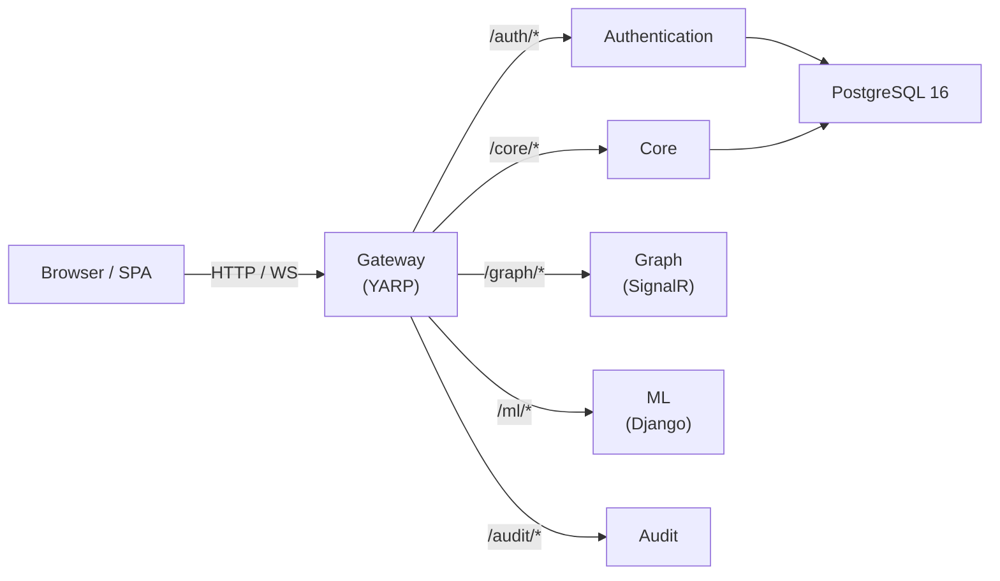
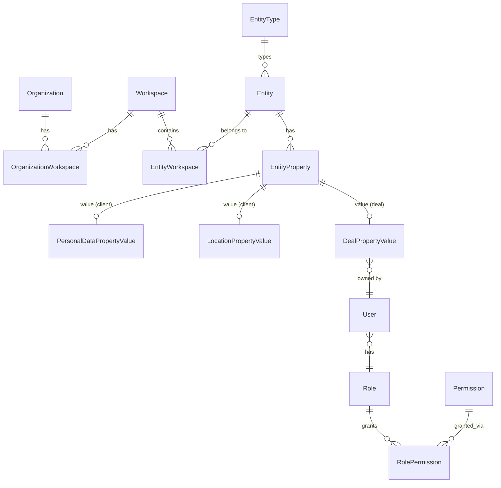
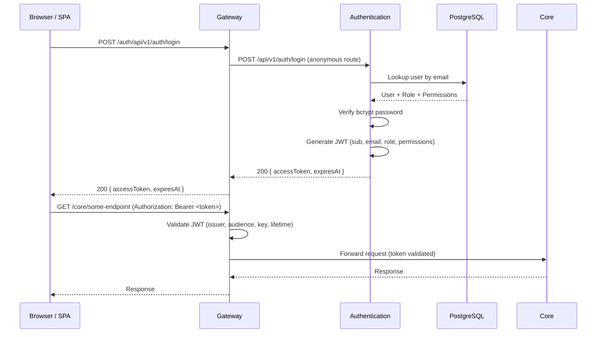

# Architecture -- Patterns, Layers, and Conventions

> **Last verified:** 2026-04-13

> **Maintenance obligation:** If you change architecture patterns, add or modify a layer, alter the persistence model, change validation or auth flows, or introduce new cross-cutting concerns, update this file and its "Last verified" date before finishing your task. See [AI-GUIDES-INDEX.md](../../AI-GUIDES-INDEX.md) for the full update matrix.

---

## High-Level Architecture



All client traffic flows through the **Gateway**. Backend services do not call each other directly -- there is no message bus, no gRPC, no service-to-service HTTP. The Gateway strips path prefixes and forwards requests to upstream services by internal Docker DNS.

---

## Layered / Clean Architecture

The project uses a **ports-and-adapters (Clean Architecture)** pattern. Each service that follows this pattern is split into four projects:

| Layer | Responsibility | Naming convention |
|---|---|---|
| **Host** | `Program.cs`, endpoint mapping, middleware | `Relativa.<Service>` |
| **Application** | Use cases, DTOs, validators, service interfaces/implementations | `Relativa.<Service>.Application` |
| **Domain** | Repository interfaces, service contracts, domain logic | `Relativa.<Service>.Domain` |
| **Infrastructure** | DbContext, EF repositories, external service implementations (JWT, bcrypt) | `Relativa.<Service>.Infrastructure` |

### Current state per service

| Service | Host | Application | Domain | Infrastructure |
|---|---|---|---|---|
| **Authentication** | Implemented | Implemented (AuthService, DTOs, validators) | Implemented (interfaces only) | Implemented (AuthDbContext, repos, JWT, bcrypt) |
| **Core** | Implemented (health only) | **Empty .csproj** | **Empty .csproj** | Implemented (RelativaDbContext) |
| **Gateway** | Implemented | N/A (single project) | N/A | N/A |
| **Graph** | Implemented (stub hub) | N/A (single project) | N/A | N/A |
| **Audit** | Implemented (stub) | N/A (single project) | N/A | N/A |

Gateway, Graph, and Audit are single-project services with no layered split. When they grow, they should follow the same four-layer convention as Authentication.

### Dependency direction

```
Host → Application → Domain ← Infrastructure
                                    ↓
                              Persistence (shared)
```

- **Domain** defines interfaces; **Infrastructure** implements them.
- **Application** depends on Domain interfaces, never on Infrastructure directly.
- **Host** wires everything via DI and maps endpoints.
- All layers that need entities reference the shared **Persistence** library.

**Important caveat:** Domain interfaces return `Relativa.Persistence.Entities.*` types directly (e.g. `IUserRepository` returns `User`). This is a pragmatic coupling -- the domain layer is not isolated from the shared entity assembly.

---

## Shared Persistence Library

**Path:** `Persistence/src/Relativa.Persistence/`

This is a **.NET class library** (no solution, no runnable host) that holds the EF Core entity model shared across services. It is referenced via `ProjectReference` by Core, Authentication, and Migration.

### Contents

| Directory / File | What it contains |
|---|---|
| `Entities/` | 14 entity classes: `User`, `Role`, `Permission`, `RolePermission`, `Organization`, `Workspace`, `OrganizationWorkspace`, `EntityType`, `Entity`, `EntityWorkspace`, `EntityProperty`, `PersonalDataPropertyValue`, `LocationPropertyValue`, `DealPropertyValue` |
| `Configurations/` | EF Fluent API `IEntityTypeConfiguration<T>` classes for each entity |
| `ModelBuilderExtensions.cs` | Extension methods: `ApplyAuthEntityConfigurations` (User, Role, Permission, RolePermission only) and `ApplyAllEntityConfigurations` (full model) |

### Multiple DbContexts over one model

Different services compose **different slices** of the entity model:

| DbContext | Location | What it maps | Extension used |
|---|---|---|---|
| `AuthDbContext` | `Authentication/.../Infrastructure/Data/AuthDbContext.cs` | User, Role, Permission, RolePermission | `ApplyAuthEntityConfigurations` |
| `RelativaDbContext` | `Core/.../Infrastructure/Data/RelativaDbContext.cs` | All 14 entities | `ApplyAllEntityConfigurations` |
| `MigrationDbContext` | `Migration/.../Data/MigrationDbContext.cs` | All 14 entities | `ApplyAllEntityConfigurations` |

Migrations are owned by the **Migration** service. The migration assembly name is `Relativa.Migration`. Schema changes always go through `Migration/src/Relativa.Migration/Migrations/`.

---

## Domain Model



**Key relationships:**
- `Organization` and `Workspace` are linked via `OrganizationWorkspace` (many-to-many).
- `Entity` belongs to workspaces via `EntityWorkspace` and is typed by `EntityType` (`client` or `deal`).
- `EntityProperty` is a polymorphic property bag: each row points to at most one of `PersonalDataPropertyValue`, `LocationPropertyValue`, or `DealPropertyValue`.
- `DealPropertyValue` has an `owner` (User) and a linked `client` (Entity), plus `value`, `expected_close`, `closure_score`, and timestamps.
- RBAC: `User` -> `Role` -> `RolePermission` -> `Permission`.

---

## Validation Approach

Validation uses **FluentValidation** in the Application layer with explicit invocation in service methods.

### Flow

1. **Validator discovery:** `AddValidatorsFromAssemblyContaining<IAuthService>()` in `Program.cs` registers all validators from the Application assembly via DI.
2. **Explicit validation:** Service methods (e.g. `AuthService.RegisterAsync`) call `validator.ValidateAndThrowAsync(request)` before any business logic.
3. **Exception mapping:** `GlobalExceptionHandler` middleware catches `ValidationException` and returns HTTP 400 with structured error details.

There is **no** global automatic validation filter or minimal-API endpoint filter. Validation is always explicitly called inside the application service.

### Validators implemented

- `LoginRequestValidator` -- in `Authentication/src/Relativa.Authentication.Application/Validators/`
- `RegisterRequestValidator` -- in `Authentication/src/Relativa.Authentication.Application/Validators/`

Core has no validators yet (its Application layer is empty).

### Convention for new services

When adding validation to a new service, follow the same pattern:
1. Create `*Validator` classes in the Application project using FluentValidation.
2. Register via `AddValidatorsFromAssemblyContaining<>()` in `Program.cs`.
3. Call `ValidateAndThrowAsync` in the service method.
4. Ensure `GlobalExceptionHandler` maps `ValidationException` to 400.

---

## Authentication and Authorization Flow



### JWT details

- **Issuing service:** Authentication (`JwtTokenService`)
- **Algorithm:** HMAC-SHA256 (symmetric key from `JWT_SECRET`)
- **Claims:** `sub` (user ID), `email`, `role` (role name), `permissions` (comma-separated)
- **Validation point:** Gateway validates issuer, audience, signing key, and lifetime
- **Audit exception:** Audit service has JWT registered but all validation checks disabled (stub)

### Authorization policies

- **Gateway:** `MapReverseProxy().RequireAuthorization()` -- all proxied routes require a valid JWT unless explicitly marked anonymous in YARP route config.
- **Audit:** `AuditReaders` policy requires JWT `role` claim to be `Admin` or `Analyst`.
- **Other services:** No additional authorization policies yet.

---

## Inter-Service Communication

- **HTTP via Gateway only.** No service-to-service calls exist.
- **No message bus.** No RabbitMQ, Kafka, MassTransit, or gRPC.
- **SignalR:** Graph service exposes a WebSocket hub at `/hubs/graph` for real-time client updates (not inter-service messaging).
- **Planned:** Domain events from Core to Audit (mechanism not yet decided -- could be direct HTTP, a message bus, or outbox pattern).

---

## Cross-Cutting Concerns

| Concern | Implementation | Where |
|---|---|---|
| **Logging** | Serilog (console + rolling file) | Core, Authentication, Gateway |
| **Exception handling** | `IExceptionHandler` + `GlobalExceptionHandler` + `AddProblemDetails()` | Core, Authentication, Gateway (distinct implementations per host) |
| **Health checks** | `/health` endpoint, EF Core DB checks on Auth and Core | All .NET services |
| **API docs** | OpenAPI + Scalar (`/scalar/v1`, `/openapi/v1.json`) | Auth, Core, Gateway, Graph (dev) |
| **CORS** | `AllowAnyOrigin/Header/Method` | Core only (tighten for production) |
| **Forwarded headers** | `X-Forwarded-For`, `X-Forwarded-Proto` | Gateway |

---

## Coding Conventions

| Convention | Details |
|---|---|
| **API style** | Minimal APIs exclusively -- no MVC `[ApiController]` classes anywhere |
| **Endpoint organization** | Static extension methods (e.g. `AuthEndpoints.MapAuthEndpoints()`) |
| **DI lifetimes** | Scoped for repositories and application services; singleton for `IPasswordHasher` |
| **Configuration** | Options pattern (`Configure<JwtOptions>`, `Configure<AuthOptions>`) |
| **No `Startup.cs`** | All configuration in `Program.cs` (minimal hosting model) |
| **Target framework** | `net10.0` across all .NET projects |
| **Package versioning** | Referenced in `Asp.Versioning.Http` (Authentication) but **not yet used** in code |
