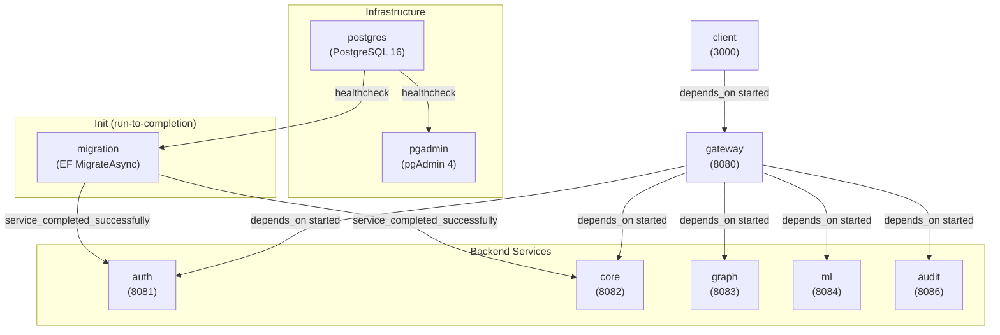

# Docker Setup -- Infrastructure and Deployment

> **Last verified:** 2026-05-01

> **Maintenance obligation:** If you change Docker Compose, Dockerfiles, networking, volumes, or environment variables, update this file and its "Last verified" date before finishing your task. See [AI-GUIDES-INDEX.md](../../AI-GUIDES-INDEX.md) for the full update matrix.

> **Note:** For operational instructions (how to start/stop the stack, pgAdmin setup, troubleshooting), see [DOCKER-BUILD.md](../../DOCKER-BUILD.md) at the repo root. This guide explains the architectural "why" and "how things connect."

---

## Compose Topology

**File:** `docker-compose.yaml` (single file, no overrides)

---

## Service Dependency Order

The startup chain enforced by Docker Compose `depends_on` conditions:

1. **postgres** starts first. Has a `pg_isready` healthcheck.
2. **pgadmin** starts once postgres is healthy (ops tool, not an app dependency).
3. **migration** starts once postgres is healthy. Runs `Database.MigrateAsync()`, applies all EF migrations, then exits with code 0.
4. **auth** and **core** start once migration completes successfully (`service_completed_successfully`). Both need the schema to be ready.
5. **graph**, **ml**, **audit** start independently (no DB dependency in compose, though Graph/Audit may add one later).
6. **gateway** starts once auth, core, graph, ml, and audit are started (so YARP has upstream targets).
7. **client** starts once gateway is started (needs `VITE_GATEWAY_URL` to resolve).

---

## Network

- **Single bridge network:** `relativa_net` (`driver: bridge`)
- All 10 services attach to this network.
- **Internal DNS:** Services resolve each other by compose service name (e.g. `postgres`, `auth`, `core`). The Gateway's YARP cluster destinations are overridden in compose to use these DNS names (e.g. `http://auth:8081/`).

---

## Volumes

| Volume | Mount | Purpose |
|---|---|---|
| `postgres_data` (named) | `/var/lib/postgresql/data` on `postgres` | Persistent DB storage. Survives `docker compose down`. Destroyed by `docker compose down -v`. |

No other named or bind-mount volumes are defined. Service containers are stateless.

---

## Port Map

| Service | Container port | Host port | Notes |
|---|---|---|---|
| postgres | 5432 | `${DB_PORT}` (default 5432) | |
| pgadmin | 80 | `${PGADMIN_PORT}` (default 5050) | |
| auth | 8081 | 8081 | |
| core | 8082 | 8082 | |
| graph | 8083 | 8083 | |
| ml | 8084 | 8084 | |
| audit | 8086 | 8086 | |
| gateway | 8080 | 8080 | Main entry point for clients |
| client | 3000 | `${CLIENT_PORT}` (default 3000) | |
| migration | -- | -- | No port (console app, exits after migration) |

---

## Dockerfiles

All Dockerfiles live in their respective service directories.

### .NET services (Auth, Core, Gateway, Graph, Audit, Migration)

Pattern: **multi-stage build**

| Stage | Base image | What it does |
|---|---|---|
| **build** | `mcr.microsoft.com/dotnet/sdk:10.0` | Restores NuGet, publishes in Release mode |
| **runtime** | `mcr.microsoft.com/dotnet/aspnet:10.0` | Copies published output, sets `ENTRYPOINT` |

**Exception:** Migration uses `sdk:10.0` as the runtime image (not `aspnet`) because it is a console host, not a web server.

### Build context details

Services that reference the shared `Persistence` library need the **repo root** as build context so the Dockerfile can `COPY` both the service directory and `Persistence/`:

| Dockerfile | Build context (in compose) | Copies Persistence? |
|---|---|---|
| `Authentication/Dockerfile` | `.` (repo root) | Yes |
| `Core/Dockerfile` | `.` (repo root) | Yes |
| `Migration/Dockerfile` | `.` (repo root) | Yes |
| `Gateway/Dockerfile` | `./Gateway` | No |
| `Graph/Dockerfile` | `./Graph` | No |
| `Audit/Dockerfile` | `./Audit` | No |

### Non-.NET services

| Dockerfile | Base image | Notes |
|---|---|---|
| `ML/Dockerfile` | `python:3.11-slim` | `pip install -e .` from `pyproject.toml`, runs `manage.py runserver` |
| `Client/Dockerfile` | `node:20-alpine` | `npm ci`, runs `npm run dev -- --host 0.0.0.0 --port 3000` |

---

## Environment Configuration

### `.env.example` (repo root)

Template for Docker Compose variable substitution. Users copy to `.env` (gitignored).

| Variable | Used by | Purpose |
|---|---|---|
| `DB_NAME` | postgres, auth, core, migration | Database name |
| `DB_USER` | postgres, auth, core, migration | Database username |
| `DB_PASS` | postgres, auth, core, migration | Database password |
| `DB_PORT` | postgres | Host-exposed port |
| `PGADMIN_DEFAULT_EMAIL` | pgadmin | Admin email |
| `PGADMIN_DEFAULT_PASSWORD` | pgadmin | Admin password |
| `PGADMIN_PORT` | pgadmin | Host-exposed port |
| `CLIENT_PORT` | client | Host-exposed port |
| `VITE_GATEWAY_URL` | client | Gateway URL the SPA calls |
| `CORS_ORIGIN_1` | gateway | First allowed browser origin for gateway CORS allowlist |
| `CORS_ORIGIN_2` | gateway | Second allowed browser origin for gateway CORS allowlist |
| `CORS_ALLOW_ANY_ORIGIN_FOR_DEV` | gateway | Local dev-only wildcard CORS override (`true`/`false`) |
| `JWT_SECRET` | auth, gateway | Shared symmetric signing key |
| `JWT_ISSUER` | auth, gateway | Token issuer claim |
| `JWT_AUDIENCE` | auth, gateway | Token audience claim |

### How env vars reach services

- **Docker Compose** injects environment variables into containers. Values come from `.env` via `${VAR}` substitution in `docker-compose.yaml`.
- **.NET services** read these as **configuration overrides** using the ASP.NET Core env-var convention: `ConnectionStrings__Default`, `Jwt__Secret`, `Jwt__Issuer`, `Jwt__Audience`, `Jwt__AccessTokenMinutes`.
- **Default values** live in each service's `appsettings.json` (localhost-friendly). Docker overrides them for the container environment.
- **Gateway YARP destinations** are overridden in compose: `ReverseProxy__Clusters__auth-cluster__Destinations__default__Address=http://auth:8081/` etc.
- **Gateway CORS policy** is configured by compose env overrides: `Cors__Origins__0`, `Cors__Origins__1`, and `Cors__AllowAnyOriginForDev`.
- **Client** reads `VITE_GATEWAY_URL` at build/dev time (Vite env prefix).

### Critical: JWT settings must match

The `JWT_SECRET`, `JWT_ISSUER`, and `JWT_AUDIENCE` values must be identical between the **auth** and **gateway** services. Auth issues tokens with these values; Gateway validates against them. A mismatch causes all authenticated requests to fail with 401.

---

## Compose Develop Watch

The `migration` service has a `develop.watch` configuration that triggers a rebuild when files in `./Migration` change. No other services have watch configs -- for live reload during development, services must be rebuilt manually (`docker compose up --build <service>`).
